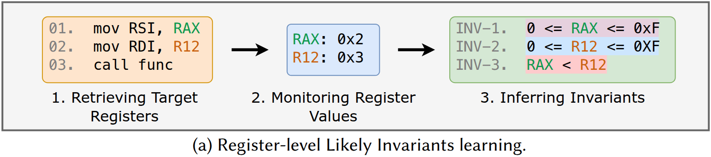
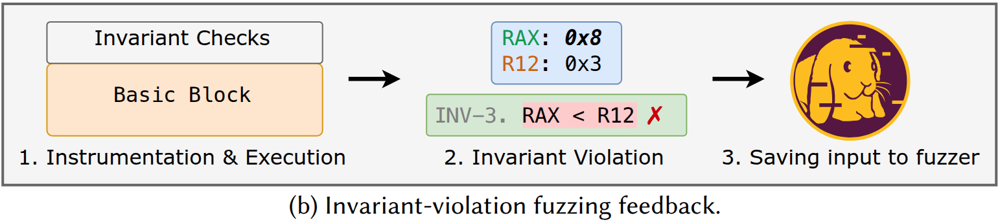

# Binvariants: Register-Level Invaraint-Guided Fuzzing for Binaries


This repository provides the source code for **Binvariants**: a prototype fuzzing framework that leverages register-level likely invariant violations for fuzzing binaries.

This work is presented in our paper [**Binvariants: Enhancing Fuzzing of Closed-source Binary Executables via Register-level Likely Invariants**](https://futures.cs.utah.edu/papers/26FSE-c.pdf) | [Slides](https://futures.cs.utah.edu/papers/26FSE-c_slides.pdf), appearing in the 2026 ACM International Conference on the Foundations of Software Engineering (FSE’26).

* [Installing Binvariants](#installing-binvariants)
* [Using Binvariants](#using-binvariants)
* [Additional Notes](#additional-notes)
* [Bug Trophy Case](#bug-trophy-case)


<br>
<br>

<table>
  <tr>
    <td><b>Citing this repository:</b></td>
    <td>
      <code class="rich-diff-level-one">@inproceedings{yang:binvariants, title = {Binvariants: Enhancing Fuzzing of Closed-source Binary Executables via Register-level Likely Invariants}, author = {Zao Yang and Stefan Nagy}, year = {2026}, issue_date = {July 2026}, publisher = {Association for Computing Machinery}, address = {New York, NY, USA}, volume = {3}, number = {FSE}, journal = {Proc. ACM Softw. Eng.}}</code>
    </td>
  </tr>
  <tr>
    <td><b>Developers:</b></td>
    <td>Zao Yang (<a href="mailto:zao.yang@utah.edu">zao.yang@utah.edu</a>) and Stefan Nagy (<a href="mailto:snagy@cs.utah.edu">snagy@cs.utah.edu</a>)</td>
  </tr>
  <tr>
    <td><b>License:</b></td>
    <td><a href="LICENSE">MIT License</a></td>
  </tr>
  <tr>
    <td><b>Disclaimer:</b></td>
    <td>This software is provided as-is with no warranty.</td>
  </tr>
</table>


# Installing Binvariants

Binvariants is built atop [**AFL++**](https://github.com/AFLplusplus/AFLplusplus/releases/tag/v4.21c) and [**QEMU-AFL**](https://github.com/AFLplusplus/qemuafl/tree/a6f0632a65e101e680dd72643a6128dd180dff72).
Install the [dependencies](https://github.com/AFLplusplus/AFLplusplus/blob/stable/docs/INSTALL.md) required by these projects before setting up Binvariants:

```
sudo apt-get update
sudo apt-get install -y build-essential python3-dev automake cmake git flex bison libglib2.0-dev libpixman-1-dev python3-setuptools cargo libgtk-3-dev
# try to install llvm-18 and install the distro default if that fails
sudo apt-get install -y lld-18 llvm-18 llvm-18-dev clang-18 || sudo apt-get install -y lld llvm llvm-dev clang
sudo apt-get install -y gcc-$(gcc --version|head -n1|sed 's/\..*//'|sed 's/.* //')-plugin-dev libstdc++-$(gcc --version|head -n1|sed 's/\..*//'|sed 's/.* //')-dev
sudo apt-get install -y meson ninja-build # for QEMU mode
```


Binvariants include two components:
* [1-Invariant_Learner/](1-Invariant_Learner/README.md)
* [2-Fuzzer/](1-Fuzzer/README.md)

To build each, navigate to their corresponding directory and run the following commands:

```
./1_patch.sh
./2_build.sh
```


# Using Binvariants
[Example/](Example/README.md) contains the example scripts and test cases for using `Binvariants` to fuzz [nconvert](https://www.xnview.com/en/nconvert/) binary. You can modify the scripts to fuzz other binaries.
## Setup
Before using Binvariants, disable `ASLR`, as it needs consistent basic block addresses between invariant learning and fuzzing:
```
sudo sysctl -w kernel.randomize_va_space=0
```


## Learning Register-Level Likely Invariants (RLIs)

To learn invariants, run:
```
./Example/1-learn_invs.sh [Binvariants_Root]
```
The inferred RLIs will be saved in the directory specified by `BINV_TRACES_DIR` in [1-learn_invs.sh](./Example/1-learn_invs.sh), named: `[PROGRAM]_trace_qemu_invs`.


## Fuzzing with RLIs
To start fuzzing with `Binvariants`, run:
```
./Example/2-fuzz.sh [Binvariants_Root] [Fuzz_Time] [Trial_Number]
```
For instance, run the 1st trial of a 48-hour fuzzing campaign from Binvariants' root directory:
```
./Example/2-fuzz.sh $PWD 48h 1
```


# Additional Notes
Below are potential enhancements to Binvariants.

### Adaptively Learning Invariants
Currently, Binvariants learns invariants before fuzzing and then runs fuzzing separately. A possible enhancement is to learn invariants during fuzzing and update them as violations occur, allowing feedback to evolve over time.

Possible design considerations:
1. If invariants are updated during the execution of a test case that later crashes or times out, the update may need to be reverted. A practical solution is to apply updates to a copy of the invariants and commit them only if the test case completes normally (i.e, `FSRV_RUN_OK`).
2. As fuzzing runs and invariants are updated, violations will naturally become less frequent. This risks AFL++ repeatedly selecting early-stage test cases (which trigger more violations but represent less-evolved program states). A [weight/perf_score/top_rated](https://github.com/AFLplusplus/AFLplusplus/blob/stable/src/afl-fuzz-queue.c) adjustment on AFL++ side may be needed to ensure that later, more representative test cases are selected.


### Cross-Basic-Block Invariants
Binvariants currently focuses on single-block invariants. A potential enhancement is supporting cross-block invariants. It requires new data structures to track register values across block boundaries, as well as additional instrumentation to check violations when control transfers between blocks.


# Bug Trophy Case
| Programs | Reported Bugs |
| ---- | ---- |
| nconvert | https://newsgroup.xnview.com/viewtopic.php?t=49598 |
| xls2csv | https://github.com/vbwagner/catdoc/issues/6, https://github.com/vbwagner/catdoc/issues/7, https://github.com/vbwagner/catdoc/issues/8, https://github.com/vbwagner/catdoc/issues/9, https://github.com/vbwagner/catdoc/issues/10, https://github.com/vbwagner/catdoc/issues/11, https://github.com/vbwagner/catdoc/issues/12, https://github.com/vbwagner/catdoc/issues/13 |
| gpmf | https://github.com/gopro/gpmf-parser/issues/201, https://github.com/gopro/gpmf-parser/issues/202, https://github.com/gopro/gpmf-parser/issues/203 |
| hdf5 | https://github.com/HDFGroup/hdf5/issues/5831, https://github.com/HDFGroup/hdf5/issues/5832, https://github.com/HDFGroup/hdf5/issues/5834 | 
| storm | https://github.com/ladislav-zezula/StormLib/issues/397, https://github.com/ladislav-zezula/StormLib/issues/398 |
| mp4split | https://github.com/axiomatic-systems/Bento4/issues/1038, https://github.com/axiomatic-systems/Bento4/issues/1039 |
| cpdf | https://github.com/johnwhitington/camlpdf/issues/75 |
| sfconvert | https://github.com/mpruett/audiofile/issues/73 |


If you find any other bugs using Binvariants, please let us know!

# Acknowledgement
This material is based upon work supported by the National Science Foundation (NSF) under Award No. 2419798, and by the Defense Advanced Research Projects Agency (DARPA) under Award No. FA8750-24-2-0002, Subaward No. GR105409-SUB00001384. 
